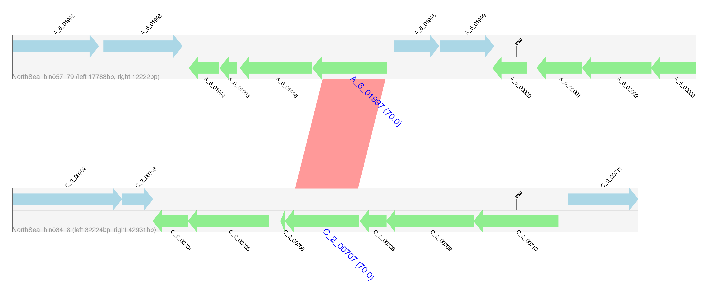
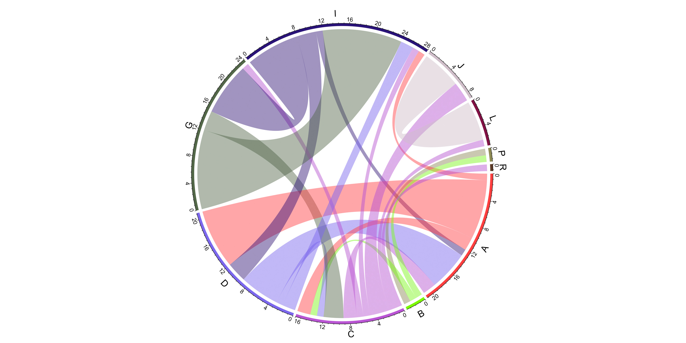
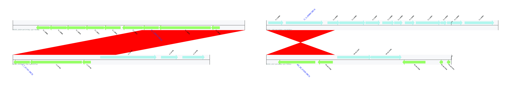
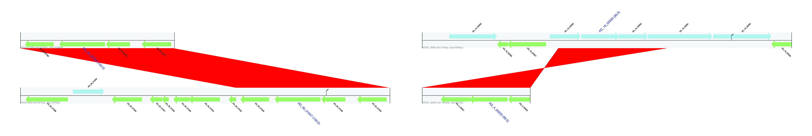

 

Publication:
---

+ **Song WZ**, Wemheuer B, Zhang S, Steensen K, Thomas T* (2019) MetaCHIP: community-level horizontal gene transfer identification through the combination of best-match and phylogenetic approaches. Microbiome. 7:36 https://doi.org/10.1186/s40168-019-0649-y
+ Contact: Weizhi Song (songwz03@gmail.com), Torsten Thomas (t.thomas@unsw.edu.au)
+ Affiliation: Centre for Marine Science and Innovation, University of New South Wales, Sydney, Australia

Change Log:
---

* v1.7.5 (2019-08-05) - Fixed a bug which causes failures in full-length contig match detection due to python2/3 differences. This bug only affects python2 users.
* v1.7.0 (2019-07-26) - Add supplementary modules: get_SCG_tree and SankeyTaxon
* v1.6.0 (2019-07-23) - Support customized grouping of query genomes
* v1.5.2 (2019-07-23) - Pfam hmm profiles updated to v32.0, TIGRFAMS db version is v14.0
* v1.5.0 (2019-07-19) - Add supplementary module: update_hmms
* v1.4.0 (2019-07-15) - Add supplementary module: filter_HGT
* v1.3.0 (2019-07-12) - Add supplementary module: CMLP
* v1.2.0 (2019-04-29) - Support multiple-level detections
* v1.1.0 (2019-01-19) - Support multiprocessing
* v1.0.0 (2018-12-29) - Initial release

Dependencies:
---

#### Python libraries
These Python libraries will be installed automatically during pip installation 
* [BioPython](https://github.com/biopython/biopython.github.io/): Python tools for computational molecular biology.
* [Numpy](http://www.numpy.org): fundamental package for scientific computing with Python.
* [SciPy](https://www.scipy.org): Python-based ecosystem for mathematics, science, and engineering.
* [Matplotlib](http://matplotlib.org): Python plotting library.
* [ETE3](http://etetoolkit.org): Python environment for tree exploration.

#### R packages
These R packages will be installed automatically when needed
* [optparse](https://cran.r-project.org/web/packages/optparse/index.html): command line option parser in R.
* [ape](https://cran.r-project.org/web/packages/ape/index.html): package for analyses of phylogenetics and evolution in R.
* [circlize](https://cran.r-project.org/web/packages/circlize/index.html): package for circular visualization.

#### Third-party software
MetaCHIP makes use of the following 3rd party dependencies and assumes these are on your system path. Specify full path 
to their executables in MetaCHIP's config file (MetaCHIP_config.py, which can be found in Python's folder lib/site-packages/MetaCHIP) if they are not on the system path.  
* [Prodigal](https://github.com/hyattpd/Prodigal): protein-coding gene prediction tool for prokaryotic genomes.
* [HMMER](http://hmmer.org): tool for biosequence analysis using profile hidden Markov models.
* [MAFFT](https://mafft.cbrc.jp/alignment/software/): multiple sequences alignment program.
* [BLAST+](https://blast.ncbi.nlm.nih.gov/Blast.cgi?PAGE_TYPE=BlastDocs&DOC_TYPE=Download): you know what it is!
* [FastTree](http://www.microbesonline.org/fasttree/): tool for inferring phylogenies from alignments.
* [Ranger-DTL 2.0](https://compbio.engr.uconn.edu/software/RANGER-DTL/): software for inferring gene family evolution (part of MetaCHIP, **NO NEED to install**).

How to install:
---

1. MetaCHIP can be installed via `pip`:

        # First-time installation
        pip install MetaCHIP
        
        # for upgrade
        pip install --upgrade MetaCHIP
        
1. You can either add MetaCHIP's 3rd party dependencies to your system path or specify full path to their executables in MetaCHIP_config.py which can be found in Python's folder `lib/site-packages/MetaCHIP`.

How to run:
---

1. The input files for MetaCHIP include a folder that holds the sequence file [[example](https://github.com/songweizhi/MetaCHIP/blob/master/input_file_examples/human_gut_bins)] 
of all query genomes, as well as a text file [[example](https://github.com/songweizhi/MetaCHIP/blob/master/input_file_examples/human_gut_bins_GTDB.tsv)] 
which holds taxonomic classification of all input genomes. Please make sure **the length of sequence ID** for sequences of all input genomes are  **NO LONGER THAN 22 letters**.

1. [**GTDB-Tk**](https://github.com/Ecogenomics/GTDBTk) is recommended for taxonomic classification of input genomes. 
GTDB-Tk with produce two files ([prefix].bac120.summary.tsv and [prefix].ar122.summary.tsv) containing the classification results 
if you have both bacterial and archaeal genomes included in your queries. You need to combine the two files into one and feed it as an input for MetaCHIP.

1. Options for argument '-r' for PI and BP modules can be any combinations of d (domain), p (phylum), c (class), o (order), f (family) and g (genus).

1. The all-against-all blastn comparison is the most time-consuming step. 
   You can speed up this step with job scripts if you are running MetaCHIP with HPC. 
   An example of the job script header [[example](https://github.com/songweizhi/MetaCHIP/blob/master/input_file_examples/blastn_job_script_header_demo.sh)] is needed in this case.
   The "MetaCHIP BP" module must be run **AFTER** all submitted jobs are finished.

1. Output format for BLASTN in the PI and BP steps: 
        
        -outfmt "6 qseqid sseqid pident length mismatch gapopen qstart qend sstart send evalue bitscore qlen slen"

1. Some examples: 

    * show help information

            MetaCHIP -h
            MetaCHIP PI -h
            MetaCHIP BP -h
                
    * Detect HGT at single level (e.g. class) with 6 CPU cores
    
            MetaCHIP PI -p NorthSea -r c -t 6 -i bin_folder -x fasta -taxon NorthSea_GTDB_bac120_ar122_combined.tsv
            MetaCHIP BP -p NorthSea -r c -t 6

    * Detect HGT at multiple levels (e.g. phylum, class and order) with 12 CPU cores

            MetaCHIP PI -p NorthSea -r pco -t 12 -i bin_folder -x fasta -taxon NorthSea_GTDB_bac120_ar122_combined.tsv
            MetaCHIP BP -p NorthSea -r pco -t 12

    * Run MetaCHIP with qsub to speed up all-against-all blastn comparison. 
      Here is an example of the job script header file ([blastn_js_header.sh](https://github.com/songweizhi/MetaCHIP/blob/master/input_file_examples/blastn_js_header.sh)).
      **The BP module can only be run after all submitted jobs were finished!!!**
    
            MetaCHIP PI -p NorthSea -r pcofg -t 9 -i bin_folder -x fasta -taxon NorthSea_GTDB_bac120_ar122_combined.tsv -blastn_js_header blastn_js_header.sh -qsub
            MetaCHIP BP -p NorthSea -r pcofg -t 9

    * Detect HGT with customized grouping file.
      Here is an example of the customized grouping file ([customized_grouping.txt](https://github.com/songweizhi/MetaCHIP/blob/master/input_file_examples/customized_grouping.txt)).
      NOTE: bin file extension (e.g. fasta or fa) should **NOT** be included in the grouping file.
        
            MetaCHIP PI -p NorthSea -g customized_grouping.txt -t 6 -i NS_37bins -x fasta
            MetaCHIP BP -p NorthSea -g customized_grouping.txt -t 6

Output files:
---

1. A Tab delimited text file containing all identified HGTs. Filename format: `[prefix]_[taxon_ranks]_detected_HGTs.txt`

    |Column|Description|
    |---|---|
    |Gene_1|The 1st gene involved in a HGT event|
    |Gene_2|The 2nd gene involved in a HGT event|
    |Identity|Identity between Gene_1 and Gene_2|
    |Occurence(taxon_ranks)|Only for multiple-level detections. If you performed HGT detection at phylum, class and order levels, a number of "011" means current HGT was identified at class and order levels, but not phylum level.|
    |End_match|End match or not (see examples below)|
    |Full_length_match|Full length match or not (see examples below)|
    |Direction|Direction of gene flow|   

1. Nucleotide and amino acid sequences of identified donor and recipient genes.

1. Flanking regions of identified HGTs. Genes encoded on the forward strand are displayed in light blue, and genes coded on the reverse strand are displayed in light green. The name of genes predicted to be HGT are highlighted in blue, large font with pairwise identity given in parentheses. Contig names are provided at the left bottom of the sequence tracks and numbers following the contig name refer to the distances between the gene subject to HGT and either the left or right end of the contig. Red bars show similarities of the matched regions between the contigs based on BLASTN results.
    

        
1. Gene flow between groups. Bands connect donors and recipients, with the width of the band correlating to the number of HGTs and **the colour corresponding to the donors**.
    

1. Examples of contig end matches.
       

        
1. Examples of full-length contig matches
    

