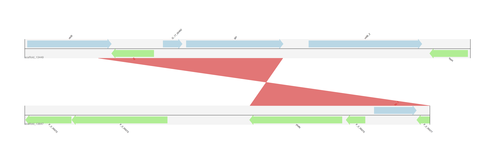
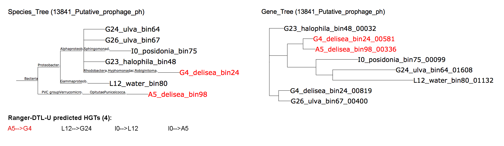

MetaCHIP (Community level Hgt Identification Pipeline)
---

This pipeline was developed to identify HGTs at community level by the combination of best Blast matches and explicit phylogenetic methods.

+ Author: Weizhi Song (weizhi.song@student.unsw.edu.au)

+ Affiliation: The Centre for Marine Bio-Innovation (CMB), The University of  New South Wales, Sydney, Australia

Dependencies:
---

+ [BioPython](https://github.com/biopython/biopython.github.io/)
+ [ETE3](http://etetoolkit.org)
+ [Numpy](http://www.numpy.org)
+ [SciPy](https://www.scipy.org)
+ [Matplotlib](http://matplotlib.org)
+ [Pillow 3.3.1](https://pypi.python.org/pypi/Pillow/3.3.1)
+ [ReportLab](http://www.reportlab.com)
+ [Clustal Omega 1.2.3](http://www.clustal.org/omega/)
+ [Gblocks 0.91b](http://molevol.cmima.csic.es/castresana/Gblocks.html)
+ [FastTree 2.1.9](http://www.microbesonline.org/fasttree/)
+ [Ranger-DTL 1.0](http://compbio.mit.edu/ranger-dtl/)
+ [Prokka](http://www.vicbioinformatics.com/software.prokka.shtml)
+ [PhyloSift](https://phylosift.wordpress.com)

Prepare input files:
---

1. Configuration file

        [FILES_AND_PARAMETERS]
        working_directory = /Users/weizhisong/Desktop/working_directory
        cover_cutoff = 70
        align_len_cutoff = 100
        ffn_file = combined.ffn
        identity_percentile = 95
        gbk_file_name = combined.gbk
        grouping_file = grouping.txt
        inputs_folder_name = input_files
        blast_results = all_vs_all_blastn.tab
        ortholog_group_folder_name = ortholog_groups

        [DEPENDENCIES]
        programs_for_HGT_prediction = Ranger-DTL AnGST
        path_to_AnGST_executable = /Users/weizhisong/Softwares/angst/angst_lib/AnGST.py
        path_to_Ranger_executable = /Users/weizhisong/Softwares/Ranger-DTL/ranger-dtl-U.mac
        path_to_gblocks_executable = /Users/weizhisong/Softwares/Gblocks/Gblocks_0.91b/Gblocks
        path_to_alignment_filter_script = /Users/weizhisong/Softwares/Gblocks/alignment_filter.py

1. Complete/draft genomes (or bins obtained from metagenomics data) in multi-fasta format.
1. Grouping of all input genomes (Group, Name, Taxonomy id).
    1. The genome name consists 2 parts, which are genus/sample name and strain name/bin number. The 2 parts must be separated by underscore.
    1. Genome group also consists two parts, the group name and genome No. in that group.
    1. If your draft/complete genome haven’t been assigned taxonomy id. ...... How to determine taxonomy: Phylosift

            A_1,ecklonia_bin31,2000033
            A_12,phylospora_bin8,2000054
            BA_1,delisea_bin26,2000019
            BA_2,amphiroa_bin24,2000004
            BA_3,ulva_bin102,2000069
            BB_1,rock_bin3,2000068

1. All_vs_All blast results

        # -outfmt "6 qseqid sseqid pident length mismatch gapopen qstart qend sstart send evalue bitscore qlen slen"

        amphiroa_bin16_00001    amphiroa_bin16_00001    100.00  444	0	0	1	444	1	444	0.0	801	444	444
        amphiroa_bin16_00001	phylospora_bin66_00042	68.30	224	67	3	13	234	205	426	6e-13	75.2	444	696
        amphiroa_bin16_00002	amphiroa_bin16_00002	100.00	2313	0	0	1	2313	1	2313	0.0	4172	2313	2313

1. Combined.ffn (from Prokka) parameters used for Prokka:locus_tag prefix
1. Cmbined.gbk (from Prokka)
1. Ortholog_groups (from get_homologues: parameters)
1. Customized NCBI taxonomy database (for ETE3) (optional)

        # 1. Download the taxonomy database from NCBI FTP server.
        wget ftp://ftp.ncbi.nih.gov/pub/taxonomy/taxdump.tar.gz

        # 2. cd to the directory where you place the taxdump.tar.gz file and unpack it.
        tar xvf taxdump.tar.gz

        # 3. Add your genomes at the end of the names.dmp and nodes.dmp files according to their formats.

        # 4. Compress customized taxonomy database.
        tar -czf names.dmp nodes.dmp merged.dmp

How to run it:
---

+ MetaCHIP scripts are implemented in python3, please use python3 instead of python.
+ All input files need to be placed in working directory!

        # modules need to be loaded first
        module load python/3.4.3
        module load blast+/2.2.31
        module load muscle/3.8.31
        module load phyml/20120412
        module load fasttree/2.1.7
        module load clustalo/1.2.2

        # first:
        python3 MetaCHIP.py
        # then:
        python3 Explicit_Tree.py

Output files:
---

1. All identified candidates (this file will be used as input for the second step).

        amphiroa_bin21_00300	caulerpa_bin21_01365
        caulerpa_bin67_00007	rock_bin3_00003
        caulerpa_bin67_00446	ulva_bin3_00142
        ...

1. All identified candidates with group and identity.

        C_7|amphiroa_bin21_00300	D_6|caulerpa_bin21_01365|75.15
        D_17|caulerpa_bin67_00007	C_3|rock_bin3_00003|76.06
        D_17|caulerpa_bin67_00446	C_11|ulva_bin3_00142|75.77
        ...

1. Determined identity cut off for each group pairs.

        A_B	71.71
        A_C	67.15
        A_D	67.92
        ...

1. Identity distribution plot for each group pair.

    

1. ACT image for checking flanking regions of identified HGTs.

    

1. Combined species tree and gene tree, as well as Ranger-DTL predicted HGTs.

    
