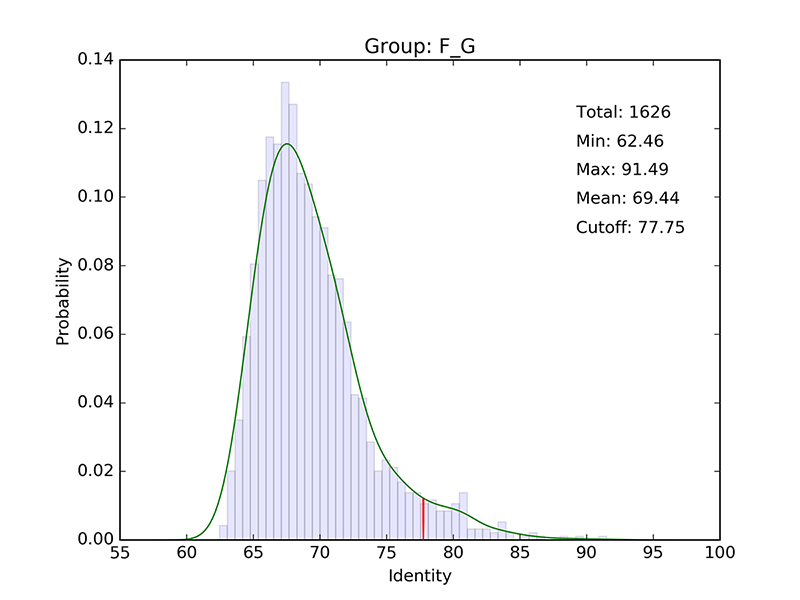
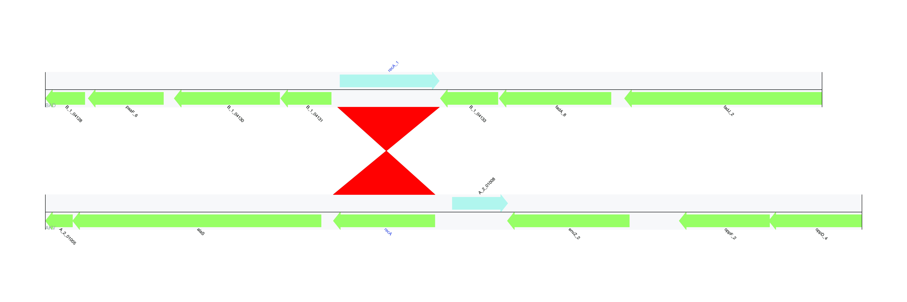

Publication
---
+ In Preparation
+ Contact: Weizhi Song (songwz03@gmail.com), Torsten Thomas(t.thomas@unsw.edu.au)
+ Affiliation: The Centre for Marine Bio-Innovation (CMB), The University of New South Wales, Sydney, Australia

Dependencies:
---
+ [BioPython](https://github.com/biopython/biopython.github.io/)
+ [ETE3](http://etetoolkit.org)
+ [Numpy](http://www.numpy.org)
+ [SciPy](https://www.scipy.org)
+ [Matplotlib](http://matplotlib.org)
+ [Pillow 3.3.1](https://pypi.python.org/pypi/Pillow/3.3.1)
+ [ReportLab](http://www.reportlab.com)
+ [FastTree 2.1.9](http://www.microbesonline.org/fasttree/)
+ [Ranger-DTL 1.0](http://compbio.mit.edu/ranger-dtl/)
+ [Prokka](http://www.vicbioinformatics.com/software.prokka.shtml)

Prepare input files:
---
1.
1.
1. Grouping of all input genomes (Group, Name, Taxonomy id).
    1. The genome name consists 2 parts, which are genus/sample name and strain name/bin number. The 2 parts must be separated by underscore.
    1. Genome group also consists two parts, the group name and genome No. in that group.
    1. If your draft/complete genome haven’t been assigned taxonomy id. ...... How to determine taxonomy: Phylosift

            A,ecklonia_bin31
            A,phylospora_bin8
            BA,delisea_bin26
            BA,amphiroa_bin24
            BA,ulva_bin102
            BB,rock_bin3

1. All_vs_All blast results

        # -outfmt "6 qseqid sseqid pident length mismatch gapopen qstart qend sstart send evalue bitscore qlen slen"

        amphiroa_bin16_00001    amphiroa_bin16_00001    100.00  444	0	0	1	444	1	444	0.0	801	444	444
        amphiroa_bin16_00001	phylospora_bin66_00042	68.30	224	67	3	13	234	205	426	6e-13	75.2	444	696
        amphiroa_bin16_00002	amphiroa_bin16_00002	100.00	2313	0	0	1	2313	1	2313	0.0	4172	2313	2313

1. Ortholog_groups (from get_homologues: parameters)

How to run it:
---

+ MetaCHIP scripts are implemented in python2.
+ All input files need to be placed in working directory!

        # First, get SCG tree and grouping
        $ python Get_tree_and_grouping.py -prokka_output prokka_output -hmm phylo.hmm

        # You may want to manully modify the grouping profile based on the taxonomy classification of input bins

        # Second, predict HGT with best-match approach
        $ python Best-match.py -g grouping.txt -a prokka_output -n all_vs_all_blast.tab

        # Third, predict HGT with phylogenetic approach
        $ python Explicit_Tree.py -cfg config.txt

Output files:
---

1. All identified candidates (this file will be used as input for the second step).

        Gene_1	Gene_2	Genome_1_ID	Genome_2_ID	Identity    End_break	Direction
        AAM_03063	BAD_01456	A_1	B_1	100.0	no	AAM<-BAD
        AMAU_05759	BHS_02873	A_4	B_4	79.02	no	AMAU<-BHS
        BAD_00475	AAM_01658	B_1	A_1	74.354	no	BAD<-AAM
        BDS_01877	AMAC_00215	B_2	A_3	100.0	no	BDS<-AMAC
        BGC_01656	AKV_01272	B_3	A_2	100.0	no	BGC<-AKV
        BNM_00983	AMAC_00159	B_5	A_3	75.269	no	BNM<-AMAC
        BNM_02093	AMS_03378	B_5	A_5	100.0	no	BNM<-AMS
        BNM_02445	AMS_01681	B_5	A_5	77.961	no	BNM<-AMS
        BNM_02717	AAM_02737	B_5	A_1	74.47	no	BNM<-AAM

1. Determined identity cut off for each group pairs.

        A_B	71.71
        A_C	67.15
        A_D	67.92
        ...

1. Identity distribution plot for each group pair.

    

1. ACT image for checking flanking regions of identified HGTs.

    

1. Combined species tree and gene tree, as well as Ranger-DTL predicted HGTs.

    
